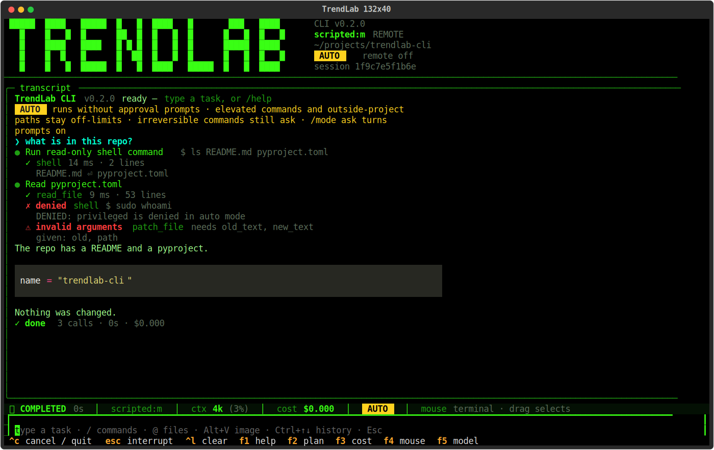
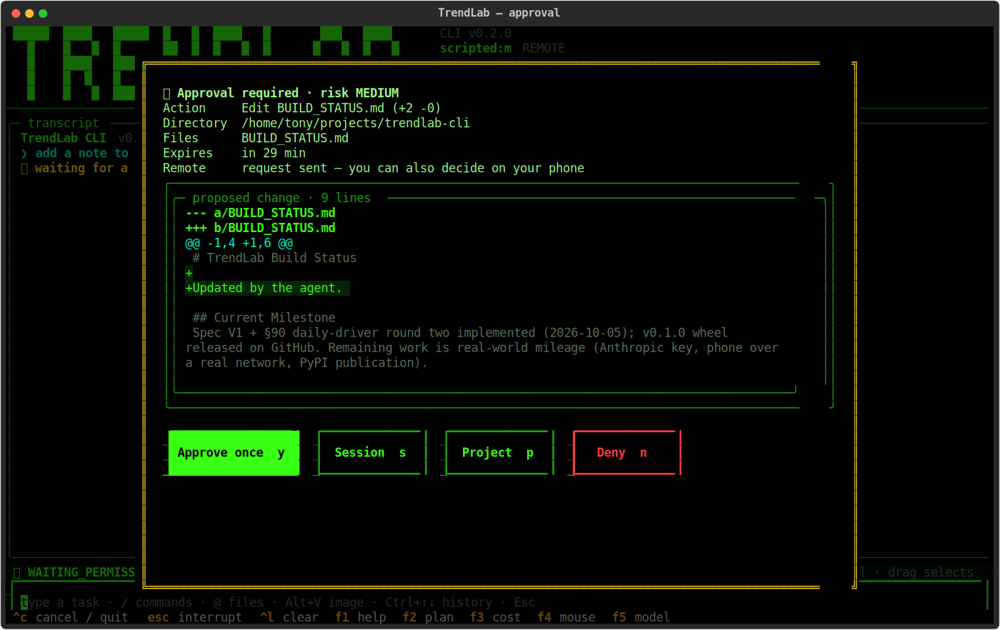
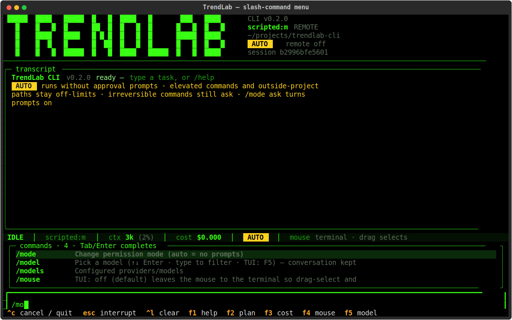
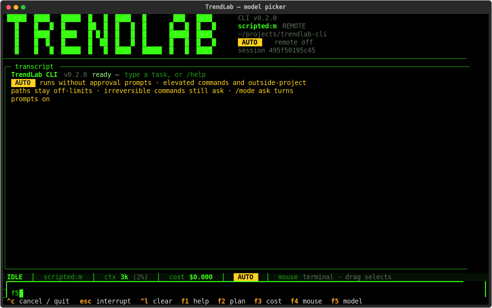
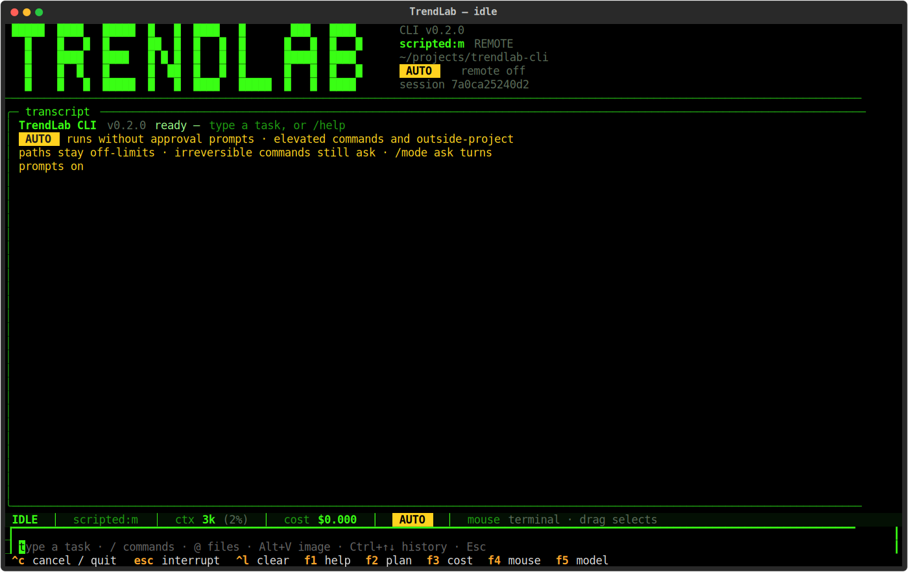
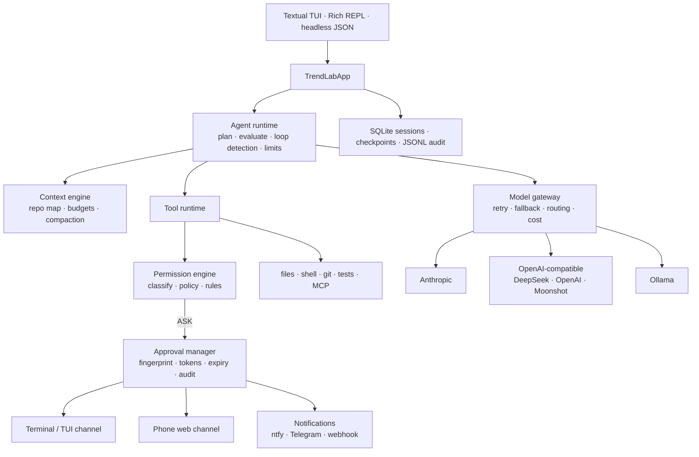

<p align="center">
  
</p>

<h1 align="center">TrendLab CLI</h1>

<p align="center">
  A local-first, model-agnostic agentic coding harness.<br>
  Give it a task, walk away, and approve the risky parts from your phone.
</p>

<p align="center">
  <a href="#"></a>
  <a href="#"></a>
  <a href="LICENSE"></a>
  <a href="docs/TRENDLAB_CLI_SPEC.md"></a>
</p>

---

## What it is

TrendLab CLI is a terminal coding agent you own end to end. It inspects a repository, plans,
edits files, runs the tests, reads the failures and iterates, and it stops only when there is
evidence the task is done. The model is a swappable part: Claude, DeepSeek, OpenAI, Moonshot,
or a local Ollama model, switchable mid-session. Every side effect passes through one
permission engine, and when a decision needs a human the request goes to the terminal **and**
to a mobile web page on your phone.

Compared with the hosted coding agents from the big model vendors, three things set it apart: the
harness is vendor-neutral, the permission system is the center of the design rather than an
add-on, and approvals are cryptographically bound to the exact operation and can be made from
another device.

## Highlights

| | |
|---|---|
| **Evidence-based completion** | A completion evaluator refuses "done" when files changed without validation or plan items are still open. Two rejections or a detected loop hand the rest of the run to a stronger model, then the default returns. |
| **Remote approval** | Authenticated phone page with the proposed diff inline, single-use decisions bound to an operation fingerprint, expiry, reminders, and a full audit trail. Questions from the agent can be answered from the phone too. |
| **Any model** | Anthropic (official SDK, adaptive thinking, prompt caching), OpenAI-compatible endpoints, Ollama. Role routing sends research to a cheap model and review to a strong one. Provider fallback on infrastructure failures. |
| **Real editing** | Exact-text `patch_file`, unified-diff `apply_patch` (multi-file, all-or-nothing), atomic writes with hash conflict protection, automatic checkpoints and `/undo`. |
| **Long sessions** | Repository map, token budgeting, structured compaction, SQLite persistence, resume in place. |
| **Safety that survives autonomy** | `sudo` and paths outside the project are denied in every mode. Irreversible commands keep a prompt. Writes that look like secrets are blocked. Everything is logged with secrets redacted. |
| **Git and GitHub** | `/commit` writes the message from the diff, `/pr` pushes a branch and opens a pull request through `gh`, `/issue N` pulls an issue into the conversation (the PR closes it), `/worktree` runs a task on a throwaway checkout. |
| **Looks things up** | `web_search` and `web_fetch` tools (network category, so they prompt in ask mode) for docs, changelogs and error sources. |
| **Sandboxed shell** | Commands run under bubblewrap: read-only system, writable project, private `/tmp`, no network unless the command is a network or package tool. Defence in depth under the permission engine. |
| **Fixes its own mistakes early** | After every edit the matching linters and type-checkers run (ruff, pyright, tsc, eslint, cargo check, go vet) and problems go straight back to the model. Read-only tool calls run in parallel. |
| **Your own commands** | `.trendlab/commands/review.md` becomes `/review-style` with `$ARGUMENTS`; `@path` attaches a file with a fuzzy picker in the TUI; `background_process` keeps a dev server running while the agent works. |
| **Remembers your project** | After a run that edits, validates or gets corrected, the agent writes the durable facts it learned (how tests run, conventions, pitfalls) to `.trendlab/memory.md` and loads them into every later session. `/memory` shows them, `/remember` adds one. |
| **Branch a conversation** | `/branch` forks the session to try another idea, `/tree` shows the family, `/resume` jumps back. |
| **Remote control from Telegram** | Turn it on and your chat becomes a second keyboard for the running session: a message starts a task, text while it runs steers it, replies answer the agent's questions, `/status` `/plan` `/diff` `/cost` `/stop` work, and every run reports back. |
| **Plan gate and Telegram buttons** | `--plan-gate` holds the first edit until you approve the plan from the terminal, the phone page or Telegram inline buttons (Approve once · Session · Deny). |
| **See everything it does** | Every tool call shows what ran (the command, path or query), a preview of what came back, the first error line when it failed, and a reason when a call was denied, invalid or blocked. Answer first, then one quiet line: calls, time, cost, changed files, validated or not. Same in the plain REPL. |
| **Input that fits real work** | Multi-line prompts, `$EDITOR` for long ones, **Alt+V (or Ctrl+V where the terminal lets it through) pastes a screenshot** straight into the prompt; if the current model can't see images the prompt is routed to the cheapest vision model you have a key for, then switches back (`@file.png` and `/paste` too), type while it runs to steer, Esc to interrupt, reasoning shown dimmed while it thinks. |
| **Ecosystem** | Sub-agents (explorer, debugger, tester, reviewer), MCP servers as tools, lifecycle hooks, reusable skills, a benchmark runner, headless JSON mode for CI. Reads `TRENDLAB.md`, `AGENTS.md` and `CLAUDE.md`. |

## Screenshots

<p align="center">
  
  <br><sub>An approval request: the exact diff, risk level, expiry, and one-key decisions. The same request is waiting on your phone.</sub>
</p>

<p align="center">
  
  <br><sub>Every tool call shows what ran and what came back. A denied sudo and an invalid edit are visible with their reasons instead of disappearing.</sub>
</p>

<p align="center">
  
  <br><sub>Type / and pick a command; Tab or Enter completes it. Ctrl+↑/↓ recall earlier prompts.</sub>
</p>

<p align="center">
  
  <br><sub>F5 switches models: every model you can use, where it runs, context size, price, and whether its key is in place. Type to filter, Enter to switch, the conversation stays.</sub>
</p>

<p align="center">
  
  <br><sub>Jet-black, neon-green, nothing else. Plan panel, live streaming pane, status bar with context size and running cost.</sub>
</p>

## Quick start

```bash
git clone https://github.com/antoniowilliams123/trendlab-cli && cd trendlab-cli
python3 -m venv .venv && .venv/bin/pip install -e ".[dev]"
.venv/bin/trendlab init          # pick a provider, store the key safely, write config
.venv/bin/trendlab doctor        # check keys, tools and settings
cd ~/some-project && trendlab    # type a task
```

Keys never live in config files. `trendlab init` (or `trendlab secret set NAME`) stores them under
`~/.trendlab/secrets/` with mode 0600, and the environment variable of the same name takes
precedence if set.

### Everyday commands

```bash
trendlab                                   # full-screen TUI, default model from config
trendlab --plain                           # Rich REPL instead of the TUI
trendlab -m anthropic:claude-opus-5        # pick provider:model for this session
trendlab --safe                            # approval prompts on (the default mode is auto)
trendlab -p "Run the tests and fix failures" --output json    # headless, for CI
trendlab --resume latest                   # continue the last session in this project
trendlab --worktree spike                  # work on a throwaway git worktree + branch trendlab/spike
trendlab bench -m deepseek:deepseek-flash  # five fixture repos, objective metrics per model
trendlab --plan-gate                       # approve the plan before the first edit of each run
trendlab update                            # check PyPI / GitHub Releases for a newer version
```

Install globally with `pipx install git+https://github.com/antoniowilliams123/trendlab-cli.git`
(or the wheel attached to the latest [release](https://github.com/antoniowilliams123/trendlab-cli/releases)).

Inside a session: `/model`, `/plan`, `/diff`, `/undo`, `/cost`, `/review`, `/commit`, `/pr`,
`/issue`, `/worktree`, `/branch`, `/tree`, `/bg`, `/commands`, `/resume`, `/export`, `/image`,
`/paste`, `/remote`, `/approvals`, `/help`. Type `@` and a few letters to pick a file to attach.
Type `/` for a filterable command menu, Ctrl+↑/↓ for prompt history.
TUI keys: F1 help, F2 plan, F3 cost, F4 mouse, F5 model, **Esc interrupts** the current step and keeps the
conversation, and **typing while it runs steers it**: your message is delivered before the next
model call.

**Switching models** is one key: F5 (or `/model`) opens a picker with every model you can use
(configured, curated per provider, and whatever Ollama has pulled), showing where it runs, context
size, price per million and whether its key is in place. Type to filter, ↑↓, Enter. The
conversation, plan and session carry over. `/model haiku` or `/model mini` switch directly by
partial name.

Ollama models use Ollama's native API with the model's real context window (its OpenAI-style
endpoint silently cuts prompts to 2k tokens, which makes local models loop).

Small and local models sometimes write a tool call as JSON text instead of calling it; TrendLab
recognises that and runs the tool rather than accepting the JSON as the answer.

On WSL, Windows paths pasted into a prompt (`\\wsl$\Ubuntu\…`, `C:\…`) are translated to their
Linux form before the model sees them.

The TUI leaves the mouse to your terminal, so drag-select and copy (Ctrl+Shift+C, right-click)
work exactly as in any terminal; the wheel, ↑/↓ and PgUp/PgDn scroll the transcript. The plain REPL has readline history (↑/↓, Ctrl+R). Press F4 (or
`/mouse on`) when you want the app to take the mouse for clicking buttons.

## Approve from your phone

```bash
trendlab remote enable --host <tailscale-ip> --allow-insecure-http --machine-name ThinkPad
trendlab remote url        # open the pairing link once on your phone
```

Then add a notification provider (ntfy, Telegram, or a webhook) in `~/.trendlab/config.toml` and
you will be pinged when the agent needs a decision, asks a question, finishes, or stalls.

Prefer buttons? Set `remote_approval.telegram = true` with a bot token in the secrets store and
your `chat_id`: every approval arrives as a Telegram message with **Approve once · Session · Deny**
buttons (questions get one button per option, or reply to the message). Decisions are polled, so
no public URL is needed. Add `--plan-gate` and the first edit of each run waits for your go-ahead.

## Drive the session from Telegram

```toml
[telegram_bridge]
enabled = true            # or: trendlab --telegram · /telegram on

[notifications.telegram]
bot_token_env = "TRENDLAB_TELEGRAM_BOT_TOKEN"   # trendlab secret set TRENDLAB_TELEGRAM_BOT_TOKEN
chat_id = "-100…"                               # only this chat is honoured
```

The terminal session posts "online" when it starts. From the chat: send a task to start it, send
text while it runs to steer it, reply to a question to answer it, `/stop` to interrupt, and any
read-only slash command (`/status`, `/plan`, `/diff`, `/cost`, `/git log`, `/bg`) to look around.
Completion, failure, questions and pending approvals come back as messages. Permission changes,
approval decisions and session control (`/mode`, `/approvals approve`, `/quit`) stay keyboard-only;
turn on `remote_approval.telegram` if you want approval buttons in the same chat.

**How approval is protected:** a per-install bearer token with lockout, a per-request decision
token, a SHA-256 fingerprint of tool + arguments + directory that the decision must match,
single-use decisions, expiry, high-risk operations kept terminal-only by default, and a restart
that cancels stale approvals instead of executing them. Details in the
[spec, sections 17, 35 and 36](docs/TRENDLAB_CLI_SPEC.md).

## Permission modes

| Mode | Behaviour |
|---|---|
| `auto` (default) | No prompts. `sudo` and outside-project paths stay off-limits; irreversible commands still ask; every auto-approval audited; pre-edit checkpoint mandatory. |
| `trusted` | Ordinary project operations run; network, deletes and irreversible commands ask. |
| `auto_edit` | File edits run; shell, installs, network and deletes ask. |
| `ask` | Edits and risky commands ask. |
| `plan` | Read-only. |

Switch with `--mode`, `--safe`, or `/mode`. The default lives in `[defaults] permission_mode`.

## Architecture



Package layout follows the spec: `config/ permissions/ approvals/ telemetry/ sessions/ tools/
providers/ agent/ context/ orchestration/ extensions/ benchmarks/ ui/ security/`.

## Measured

Live runs on DeepSeek Flash, the default model:

| Fixture | Task | Result |
|---|---|---|
| A | single-file arithmetic bug | fixed, 5 calls, 6.5 s, $0.0018 |
| B | multi-file API status bug | fixed, 5 calls, 6.5 s, $0.0018 |
| C | broken import | fixed, 6 calls, 8.8 s, $0.0021 |
| D | edge case needing a new test | fixed + test added, 4 calls, 7.1 s, $0.0020 |
| E | refactor with tests | done, 4 calls, 5.7 s, $0.0015 |

Run your own with `trendlab bench -m provider:model`.

## Engineering notes

- **Tests are the audit trail.** 289 cases, all offline: mocked providers, a fake GitHub CLI, bare git remotes,
  a fake Telegram Bot API, Textual's headless pilot for the TUI, and a real bubblewrap sandbox test that skips
  when `bwrap` is absent. Every bug found in live use became a test the same day.
- **One permission engine, one audit log.** Tools never decide anything; they describe the operation and the
  engine applies the policy table. Approvals bind to a SHA-256 fingerprint of tool + arguments + directory.
- **Weak models are a design input.** Small local models write tool calls as text, re-plan in loops, answer
  with `{}` or promise an action they never take. The runtime recognises each of these and either runs the
  call or pushes back, and Ollama is driven through its native API so the model sees its full context window.
- **UX measured, not asserted.** A 40-point rubric with before/after and a test or screenshot per check:
  [`docs/UX_AUDIT_2026-10-05.md`](docs/UX_AUDIT_2026-10-05.md).

## Develop

```bash
.venv/bin/python -m pytest -q          # 304 tests, mocked providers, no network
.venv/bin/python -m build --wheel      # dist/trendlab_cli-*.whl for pipx install
.venv/bin/ruff check . && .venv/bin/ruff format --check .
```

The UX/UI audit against the leading hosted coding agent (40 checks, before/after, evidence per check) is in
[`docs/UX_AUDIT_2026-10-05.md`](docs/UX_AUDIT_2026-10-05.md); `scripts/ux_screenshots.py`
regenerates the screenshots. The product specification, including a dated implementation record of every change, is in
[`docs/TRENDLAB_CLI_SPEC.md`](docs/TRENDLAB_CLI_SPEC.md). Build history is in
[`BUILD_STATUS.md`](BUILD_STATUS.md).

## License

MIT
