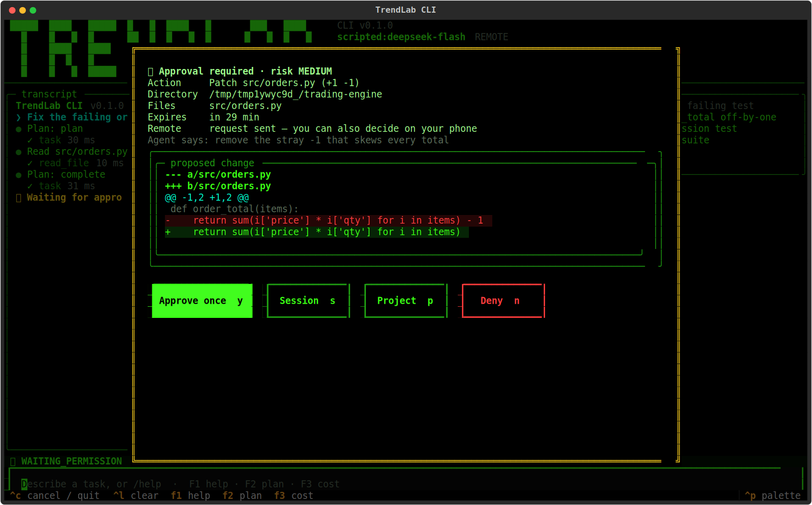
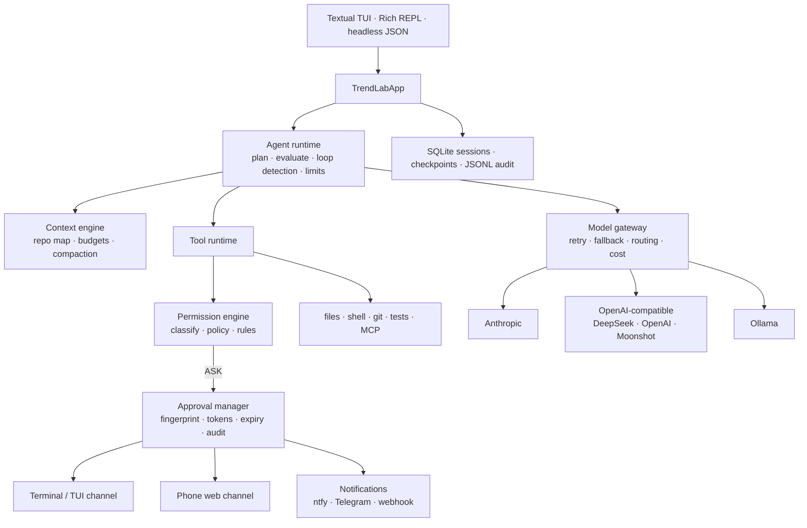

<p align="center">
  
</p>

<h1 align="center">TrendLab CLI</h1>

<p align="center">
  A local-first, model-agnostic agentic coding harness.<br>
  Give it a task, walk away, and approve the risky parts from your phone.
</p>

<p align="center">
  <a href="#"></a>
  <a href="#"></a>
  <a href="LICENSE"></a>
  <a href="docs/TRENDLAB_CLI_SPEC.md"></a>
</p>

---

## What it is

TrendLab CLI is a terminal coding agent you own end to end. It inspects a repository, plans,
edits files, runs the tests, reads the failures and iterates, and it stops only when there is
evidence the task is done. The model is a swappable part: Claude, DeepSeek, OpenAI, Moonshot,
or a local Ollama model, switchable mid-session. Every side effect passes through one
permission engine, and when a decision needs a human the request goes to the terminal **and**
to a mobile web page on your phone.

Compared with the hosted coding agents from the big model vendors, three things set it apart: the
harness is vendor-neutral, the permission system is the center of the design rather than an
add-on, and approvals are cryptographically bound to the exact operation and can be made from
another device.

## Highlights

| | |
|---|---|
| **Evidence-based completion** | A completion evaluator refuses "done" when files changed without validation or plan items are still open. Loop detection escalates to a stronger model or stops. |
| **Remote approval** | Authenticated phone page with the proposed diff inline, single-use decisions bound to an operation fingerprint, expiry, reminders, and a full audit trail. Questions from the agent can be answered from the phone too. |
| **Any model** | Anthropic (official SDK, adaptive thinking, prompt caching), OpenAI-compatible endpoints, Ollama. Role routing sends research to a cheap model and review to a strong one. Provider fallback on infrastructure failures. |
| **Real editing** | Exact-text `patch_file`, unified-diff `apply_patch` (multi-file, all-or-nothing), atomic writes with hash conflict protection, automatic checkpoints and `/undo`. |
| **Long sessions** | Repository map, token budgeting, structured compaction, SQLite persistence, resume in place. |
| **Safety that survives autonomy** | `sudo` and paths outside the project are denied in every mode. Destructive commands keep a prompt. Writes that look like secrets are blocked. Everything is logged with secrets redacted. |
| **Git and GitHub** | `/commit` writes the message from the diff, `/pr` pushes a branch and opens a pull request through `gh`, `/issue N` pulls an issue into the conversation (the PR closes it), `/worktree` runs a task on a throwaway checkout. |
| **Looks things up** | `web_search` and `web_fetch` tools (network category, so they prompt in ask mode) for docs, changelogs and error sources. |
| **Input that fits real work** | Multi-line prompts, `$EDITOR` for long ones, `@file.png` or `/paste` to attach screenshots, type while it runs to steer, Esc to interrupt, reasoning shown dimmed while it thinks. |
| **Ecosystem** | Sub-agents (explorer, debugger, tester, reviewer), MCP servers as tools, lifecycle hooks, reusable skills, a benchmark runner, headless JSON mode for CI. Reads `TRENDLAB.md`, `AGENTS.md` and `CLAUDE.md`. |

## Screenshots

<p align="center">
  
  <br><sub>An approval request: the exact diff, risk level, expiry, and one-key decisions. The same request is waiting on your phone.</sub>
</p>

<p align="center">
  
  <br><sub>Jet-black, neon-green, nothing else. Plan panel, live streaming pane, status bar with context size and running cost.</sub>
</p>

## Quick start

```bash
git clone https://github.com/antoniowilliams123/trendlab-cli && cd trendlab-cli
python3 -m venv .venv && .venv/bin/pip install -e ".[dev]"
.venv/bin/trendlab init          # pick a provider, store the key safely, write config
.venv/bin/trendlab doctor        # check keys, tools and settings
cd ~/some-project && trendlab    # type a task
```

Keys never live in config files. `trendlab init` (or `trendlab secret set NAME`) stores them under
`~/.trendlab/secrets/` with mode 0600, and the environment variable of the same name takes
precedence if set.

### Everyday commands

```bash
trendlab                                   # full-screen TUI, default model from config
trendlab --plain                           # Rich REPL instead of the TUI
trendlab -m anthropic:claude-opus-5        # pick provider:model for this session
trendlab --safe                            # approval prompts on (the default mode is unsafe)
trendlab -p "Run the tests and fix failures" --output json    # headless, for CI
trendlab --resume latest                   # continue the last session in this project
trendlab --worktree spike                  # work on a throwaway git worktree + branch trendlab/spike
trendlab bench -m deepseek:deepseek-flash  # five fixture repos, objective metrics per model
```

Inside a session: `/model`, `/plan`, `/diff`, `/undo`, `/cost`, `/review`, `/commit`, `/pr`,
`/issue`, `/worktree`, `/resume`, `/export`, `/image`, `/paste`, `/remote`, `/approvals`, `/help`. TUI keys: F1 help, F2 plan, F3 cost, **Esc interrupts** the
current step and keeps the conversation, and **typing while it runs steers it**: your message is
delivered before the next model call.

## Approve from your phone

```bash
trendlab remote enable --host <tailscale-ip> --allow-insecure-http --machine-name ThinkPad
trendlab remote url        # open the pairing link once on your phone
```

Then add a notification provider (ntfy, Telegram, or a webhook) in `~/.trendlab/config.toml` and
you will be pinged when the agent needs a decision, asks a question, finishes, or stalls.

**How approval is protected:** a per-install bearer token with lockout, a per-request decision
token, a SHA-256 fingerprint of tool + arguments + directory that the decision must match,
single-use decisions, expiry, high-risk operations kept terminal-only by default, and a restart
that cancels stale approvals instead of executing them. Details in the
[spec, sections 17, 35 and 36](docs/TRENDLAB_CLI_SPEC.md).

## Permission modes

| Mode | Behaviour |
|---|---|
| `unsafe` (default) | No prompts. `sudo` and outside-project paths denied; destructive commands still ask; every auto-approval audited; pre-edit checkpoint mandatory. |
| `trusted` | Ordinary project operations run; network, deletes and destructive commands ask. |
| `auto_edit` | File edits run; shell, installs, network and deletes ask. |
| `ask` | Edits and risky commands ask. |
| `plan` | Read-only. |

Switch with `--mode`, `--safe`, or `/mode`. The default lives in `[defaults] permission_mode`.

## Architecture



Package layout follows the spec: `config/ permissions/ approvals/ telemetry/ sessions/ tools/
providers/ agent/ context/ orchestration/ extensions/ benchmarks/ ui/ security/`.

## Measured

Live runs on DeepSeek Flash, the default model:

| Fixture | Task | Result |
|---|---|---|
| A | single-file arithmetic bug | fixed, 5 calls, 6.5 s, $0.0018 |
| B | multi-file API status bug | fixed, 5 calls, 6.5 s, $0.0018 |
| C | broken import | fixed, 6 calls, 8.8 s, $0.0021 |
| D | edge case needing a new test | fixed + test added, 4 calls, 7.1 s, $0.0020 |
| E | refactor with tests | done, 4 calls, 5.7 s, $0.0015 |

Run your own with `trendlab bench -m provider:model`.

## Develop

```bash
.venv/bin/python -m pytest -q          # 196 tests, mocked providers, no network
.venv/bin/ruff check . && .venv/bin/ruff format --check .
```

The product specification, including a dated implementation record of every change, is in
[`docs/TRENDLAB_CLI_SPEC.md`](docs/TRENDLAB_CLI_SPEC.md). Build history is in
[`BUILD_STATUS.md`](BUILD_STATUS.md).

## License

MIT
